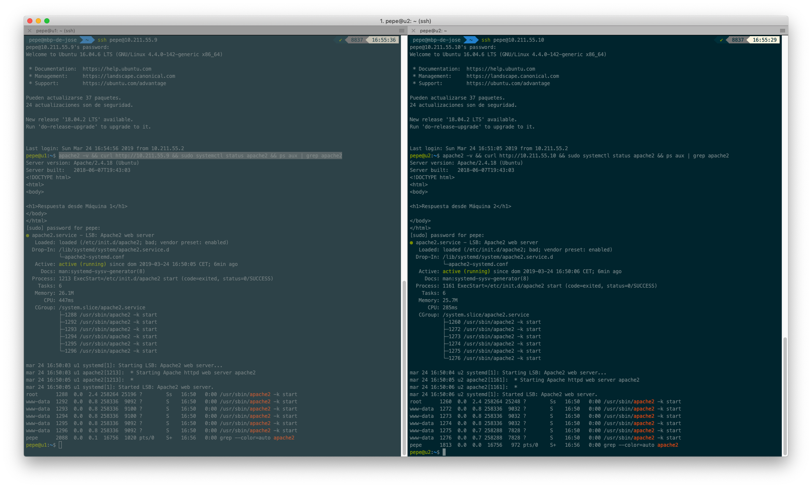
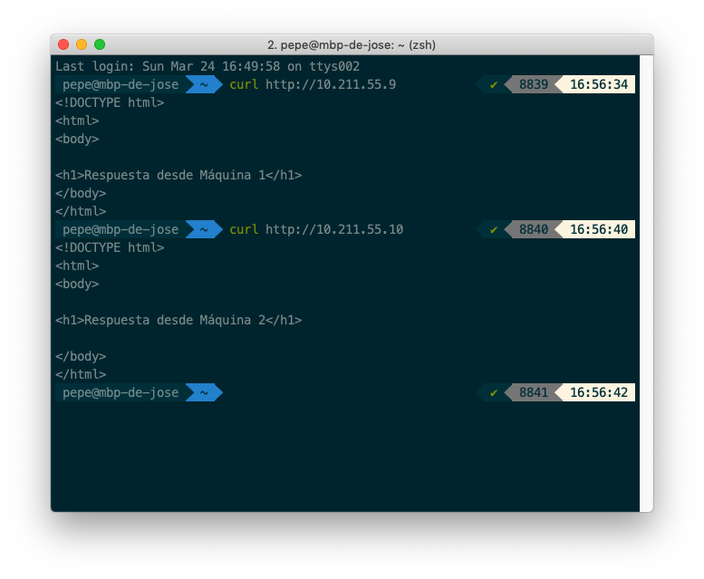

# Práctica 1: Preparación de las herramientas

```
Autor: José Antonio Córdoba Gómez
Email: joseinn@correo.ugr.es
Date:  Viernes 8 de Marzo de 2019
```

# 1 Instalar dos máquinas virtuales con OpenSSH y LAMP

El procedimiento seguido para instalar dos máquinas virtuales con el software de virtualización *Parallels Desktop* ha sido crear una nueva instancia y cargarle la imagen de _Ubuntu Server 16.04 LTS_ en la unidad óptica virtual y seguir los pasos indicados en el guión.

Una vez instaladas vamos a comprar si el servicio de apache está activo en ambas máquinas para asi poder comenzar la siguiente práctica.


Comprobacción desde la propia máquina virtual de que los servicios están funcionando correctamente:



Comprobacción desde la máquina _host_ de que los servicios están funcionando correctamente:
