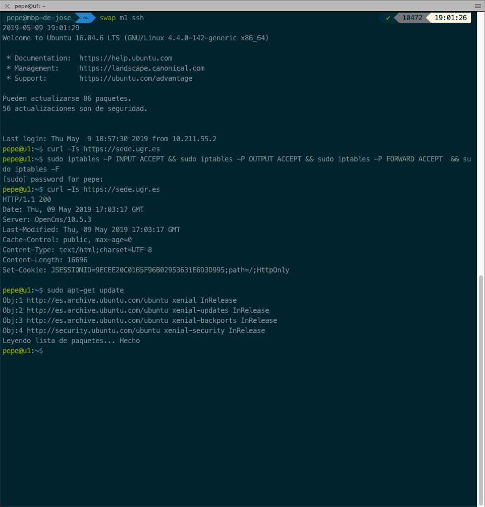
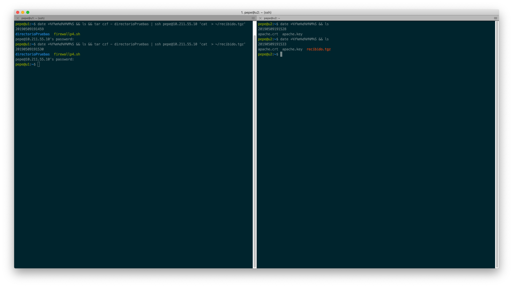
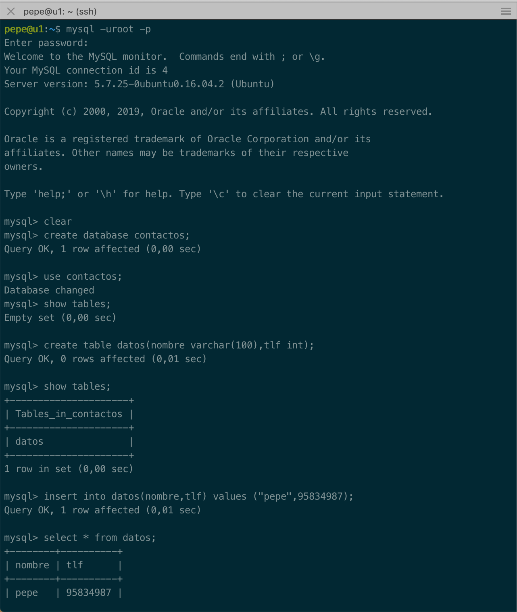
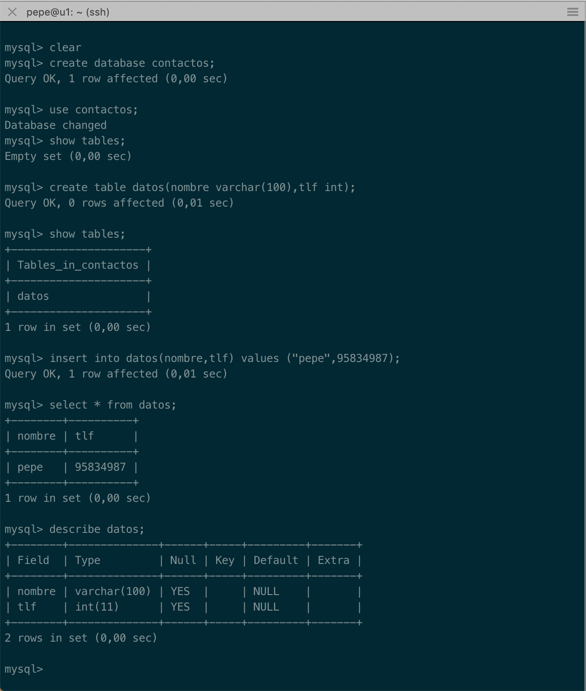
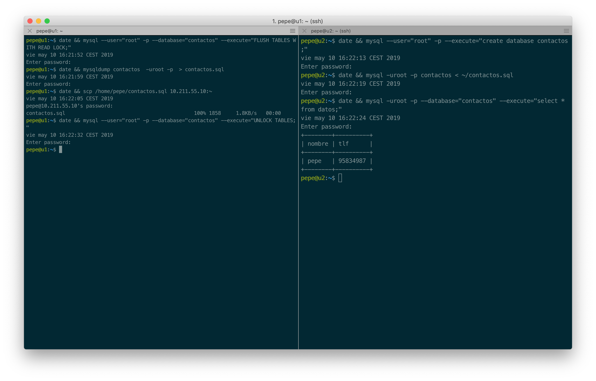
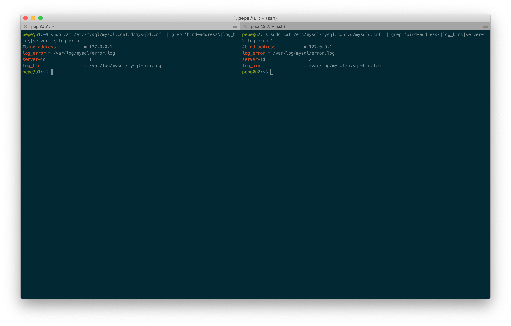
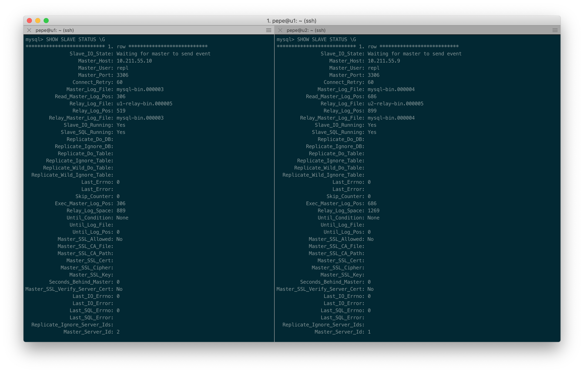
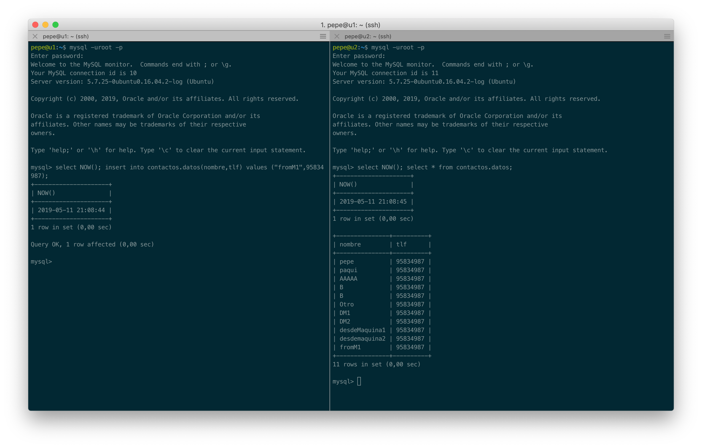
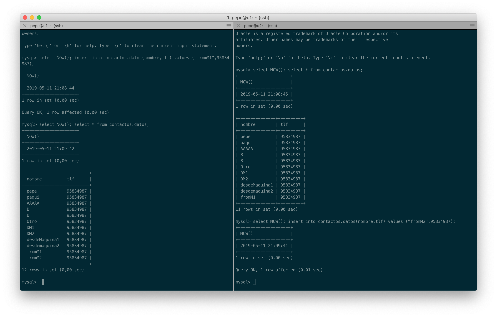
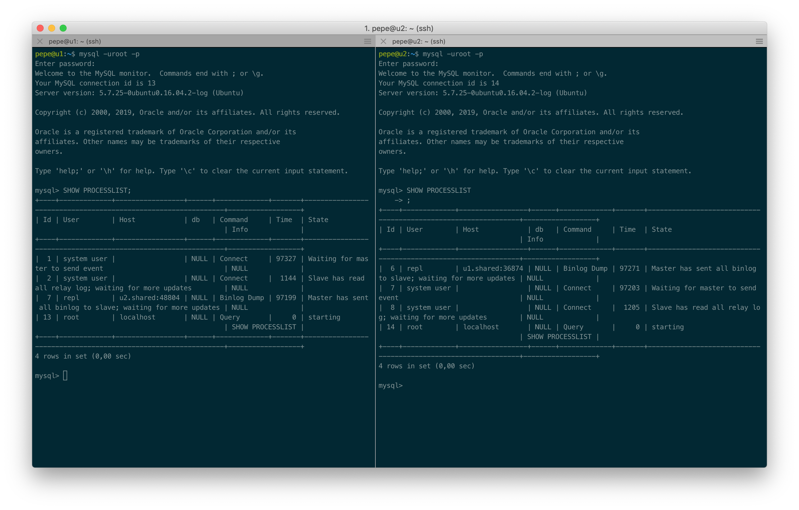

# Práctica 5: Replicación de bases de datos MySQL

```
Autor: José Antonio Córdoba Gómez
Email: joseinn@correo.ugr.es
Date:  Viernes 3 de Mayo de 2019
```

# 0. Pasos previos
Tenemos que tener en cuenta de que la secuencia de prácticas implica que la práctica 5 se realiza justo después de la práctica 4.
Este hecho hace nota que, tal y como se pedía en la práctica 4, la máquina 1 (en mi caso) tenía todas las conexiones no básicas bloqueadas, gracias a la configuración del cortafuegos pedida. Por tanto, lo primero que deberemos de hacer es restablecer las reglas del cortafuegos:


```
sudo iptables -P INPUT ACCEPT
sudo iptables -P OUTPUT ACCEPT
sudo iptables -P FORWARD ACCEPT
sudo iptables -F
```
Podemos ver el comportamiento de no conexión con la siguiente captura, donde se prueba la conectividad _http_ saliente por el puerto 80 hacia la *sede electrónica de la UGR* antes y después de restablecer la configuración del firewall. Por último también le indicamos a *apt-get* que actualice la lista de repositorios.
.

Ahora vamos a comprobar que la conectividad ssh que se consiguió en la práctica 2 (rsync) sigue estando operativa entre las máquinas y para ellos vamos a realizar la transferencia de un archivo comprimido de la máquina uno a la máquina 2.

.

Tal y como podemos observar en la captura, la conectividad sigue intacta y la transferencia se ha realizado correctamente.


Ahora ya estamos listos para comenzar la práctica 5.


# 1. Creación de una Base de Datos e inserción de datos

Primero vamos a entrar en el cliente de mysql con la contraseña que introducimos en el proceso de instalación del stack LAMP de la práctica 1.

En caso de no haber seleccionado la instalación de MySQL en dicho caso, podremos instalar rápidamente todo el stack LAMP tal y como sigue:

```
sudo tasksel install lamp-server
```

Vamos a iniciar sesión en el cliente mysql con:

```
mysql -uroot -p
```

Y posteriormente vamos a crear una base de datos llamada *contactos*, crear una tabla denominada *datos* e insertar datos en la misma, tal y como se puede ver en la siguiente captura de pantalla:




Una vez que hemos creado la base de datos, la tabla y hemos introducido unos datos, vamos a comprobar que dichos datos están insertados y la estructura de la tabla que hemos creado con motivos de supervisión previa a hacer el volcado de los datos. Vamos a asegurarnos de que todo está en orden.




Una vez llegados a este punto estamos listo para realizar el duplicado simple de la base de datos.


# 2. Replicar una BD MySQL con mysqldump

Para replicar la base de datos tenemos que tener en cuenta que mientras hacemos el volcado y lo restauramos en el resto de máquinas, se siguen permitiendo transacciones de escritura y lectura sobre la base de datos, por tanto, sería deseable bloquear las transacciones de escritura para que el respaldo sea íntegro.

Por tanto, tendremos que ejecutar las siguientes órdenes, tal y como se muestra en la captura de pantalla y en el bloque de código, para bloquear las operaciones de escritura sobre la base de datos (de forma momentánea), así mientras estamos haciendo el volcado, aseguramos que existe integridad en el volcado.

Además, añadimos una secuencialización diferente en los comandos, ya que bloqueamos las escrituras en la base de datos hasta que no volcamos los datos en la nueva máquina y verificamos que realmente están ahí.


En la primera máquina ejecutamos:

```
mysql --user="root" -p --database="contactos" --execute="FLUSH TABLES WITH READ LOCK;"

mysqldump contactos  -uroot -p  > contactos.sql

scp /home/pepe/contactos.sql 10.211.55.10:~

```

Y acto seguido ejecutamos en la segunda máquina:

```
mysql --user="root" -p --execute="create database contactos;"

mysql -uroot -p contactos < ~/contactos.sql

mysql -uroot -p --database="contactos" --execute="select * from datos;"
```

Y ahora habilitamos las operaciones de escritura de nuevo (quitamos el cerrojo) en la máquina uno:

```
mysql --user="root" -p --database="contactos" --execute="UNLOCK TABLES;
```


Podemos ver la secuenciación y resultado de las operaciones anteriormente descritas en la siguiente captura de pantalla:





# 3. Replicación de una BD mediante una configuración maestro-esclavo.

El proceso anterior implica que un operario físico haga las operaciones de volcado, siendo por tanto una forma un poco cómoda y no demasiado adecuada de actuar en un servidor en producción, por lo que vamos a realizar una configuración maestro-esclavo automática.

Primero debemos de configurar en el archivo */etc/mysql/mysql.conf.d/mysqld.cnf* el parámetro _server_id_ con un  identificador diferente para cada máquina servidora, en nuestro caso hemos asignado el identificador 1 para la máquina servidora *u1* y el identificador 2 para la máquina servidora *u2*

También vamos a comentar el parámetro *bind-address* para que pueda escuchar a otro servidor (útil para este tipo de configuración).

Y sobre el parámetro *log_bin = /var/log/mysql/bin.log* vamos a descomentarla, que en nuestra distribución aparece comentada por defecto.

Podemos ver en la siguiente captura de pantalla como se quedan estos parámetros en el archivo de configuración:




Reiniciamos el servicio en ambas máquinas con:

```
sudo systemctl restart mysql
```


Ahora creamos un usuario para el esclavo:


```
CREATE USER 'repl'@'10.211.55.9' IDENTIFIED BY 'slavepass';
GRANT REPLICATION SLAVE ON *.* TO 'repl'@'10.211.55.9';
```

Y mostramos la información del master con la posición de log de replicación:

```
SHOW MASTER STATUS;
```

En nuestro caso nos devuelve que es en la posición 154 del archivo mysql-bin.000003.

Ahora ejecutamos en la máquina 2 la siguiente instrucción para que replique el contenido de la máquina 1.


```
CHANGE MASTER TO  MASTER_HOST='10.211.55.9', MASTER_USER='repl', MASTER_PASSWORD='slavepass', MASTER_LOG_FILE='mysql-bin.000003',MASTER_LOG_POS=154,MASTER_PORT=3306;

```

Y activiamos el proceso de actualización del esclavo.

```
START SLAVE;
```

Llegados a este punto miramos al información del máster:

```
SHOW SLAVE STATUS \G;
```

Y nos fijamos en el parámetro 'seconds_behind_master'.


En nuestro caso, vamos a postponer las capturas de pantallas de demostración del funcionamiento porque antes vamos a configurar el sistema como maestro-maestro.

Para ello vamos a replicar el proceso creando un nuevo usuario en la máquina 1:

```
CREATE USER 'repl'@'10.211.55.10' IDENTIFIED BY 'slavepass';
GRANT REPLICATION SLAVE ON *.* TO 'repl'@'10.211.55.10';
```

Y mostramos la información del anterior esclavo con la posición de log de replicación:

```
SHOW MASTER STATUS;
```


En nuestro caso nos devuelve que es en la posición 154 del archivo mysql-bin.000002.


Ejecutamos la siguiente sentencia sql:
```
CHANGE MASTER TO  MASTER_HOST='10.211.55.10', MASTER_USER='repl', MASTER_PASSWORD='slavepass', MASTER_LOG_FILE='mysql-bin.000002',MASTER_LOG_POS=154,MASTER_PORT=3306;
```


Y activiamos el proceso de actualización del nuevo esclavo.

```
START SLAVE;
```

Llegados a este punto miramos al información del nuevo máster:

```
SHOW SLAVE STATUS \G;
```


Ahora vamos a ver una captura sobre la informaicón del master en cada una de las máquinas:




Como podemos observar, para cadas máquinas el valor de 'seconds_behind_master' es cero, por lo que están plenamente sincronizadas.


Llegados a este punto vamos a realizar inserciones y selecciones en ambas bases de datos para comprobar de forma práctica que dicho duplicado está funcionando:




Como podemos observar en la captura anterior, la inserción ejecutada en la máquina uno, se replica en la máquina dos, estándo por tanto visibles en ambas. En la siguiente captura podremos ver como el proceso contrario también ocurre satisfactoriamente. La inserción realizada desde la máquina 2 se replica en la máquina 1, siendo disponible el dato introducido en ambas máquinas y por tanto estando la configuración esclavo-esclavo correctamente configurada.





Por último, como curiosidad, podemos decirle a mysql que nos muestre la lista de procesos activos sobre la herramienta y podemos observar como en ambos existe un proceso iniciado por el usuario 'repl' con el identificador de la máquina desde la que se ejecuta y que es encargado de volcar el binario. También podemos ver dos procesos por los usuarios 'sysyem user' uno para sincronizarse con el master y otro para sincronizarse con el slave.

