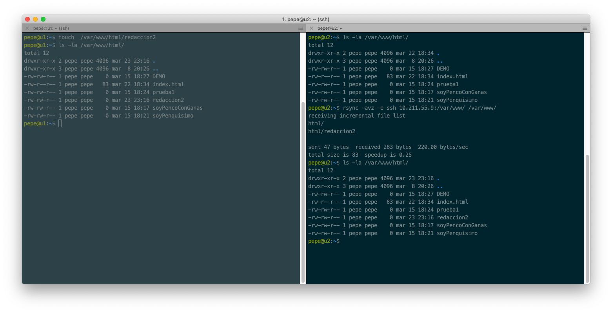
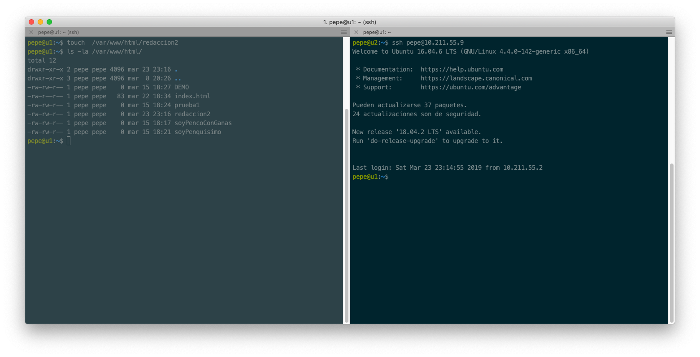
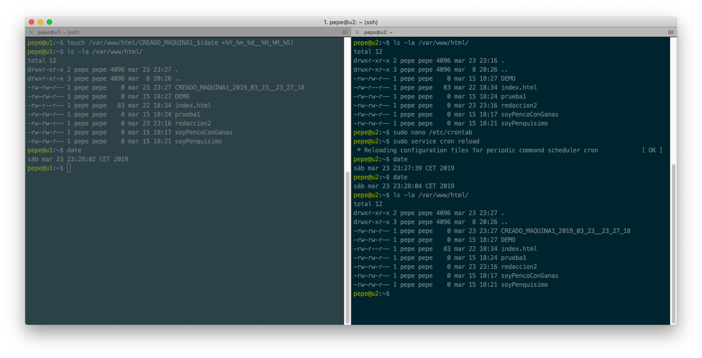

# Práctica 2: Clonar la información de un sitio web

```
Autor: José Antonio Córdoba Gómez
Email: joseinn@correo.ugr.es
Date:  Viernes 15 de Marzo de 2019
```

## 1. Instalación de la herramienta rsync

Primero vamos a instalar la herramienta rsync

```
sudo apt-get install rsync
```

A continuación vamos a establecer al usuario pepe la propiedad del directorio **/var/www/**.

```
sudo chown pepe:pepe -R /var/www
```

Y vamos a probar que dicha configuración funciona:
```
rsync -avz -e ssh 10.211.55.9:/var/www/ /var/www/
ls -la
```



## 2. Acceso sin contraseña ssh

Generamos la clave y la copiamos a la máquina 1 (10.211.55.9)
```
ssh-keygen -b 4096 -t rsa
ssh-copy-id 10.211.55.9
```

Comprobación de que el acceso ssh sin contraseña está correctamente configurado: 



## 3. Establecemos la regla crontab

Vamos a establecer la regla crontab en **/etc/crontab** para que la máquina 2 esté cada hora trayendo el contenido de la máquina 1:

```
0 * * * *   pepe    rsync -avz -e ssh pepe@10.211.55.9:/var/www/ /var/www/
```

Para probar que funciona, hemos puesto la regla a cada minuto, para evitar la espera de 1 hora.

```
* * * * *   pepe    rsync -avz -e ssh pepe@10.211.55.9:/var/www/ /var/www/
```

Comprobación de que la regla crontab se ejecuta:

