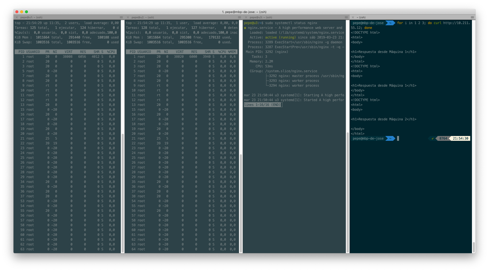
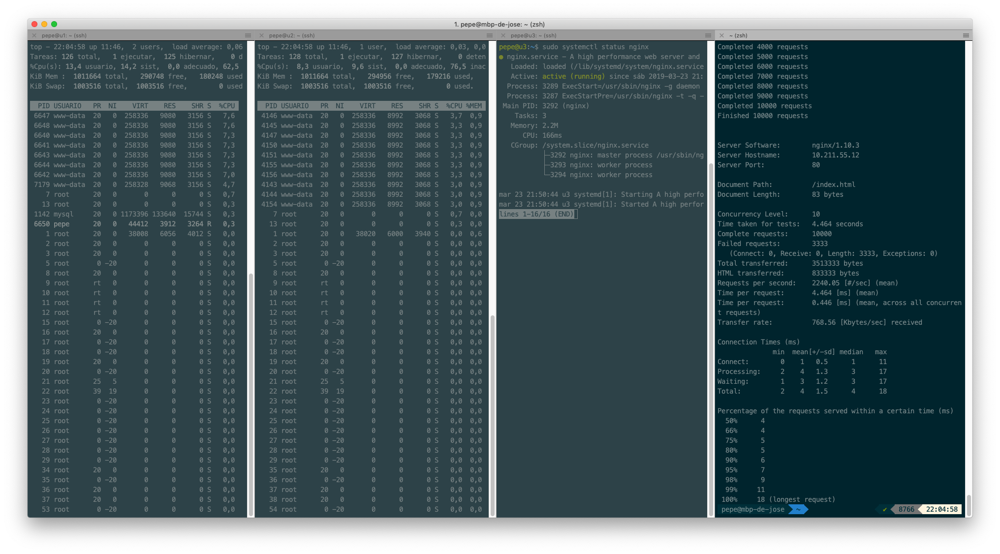
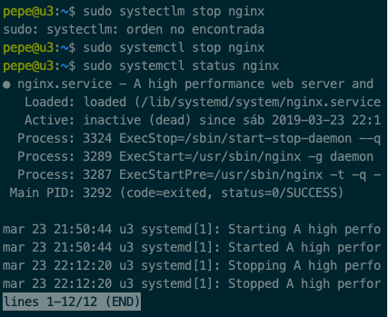
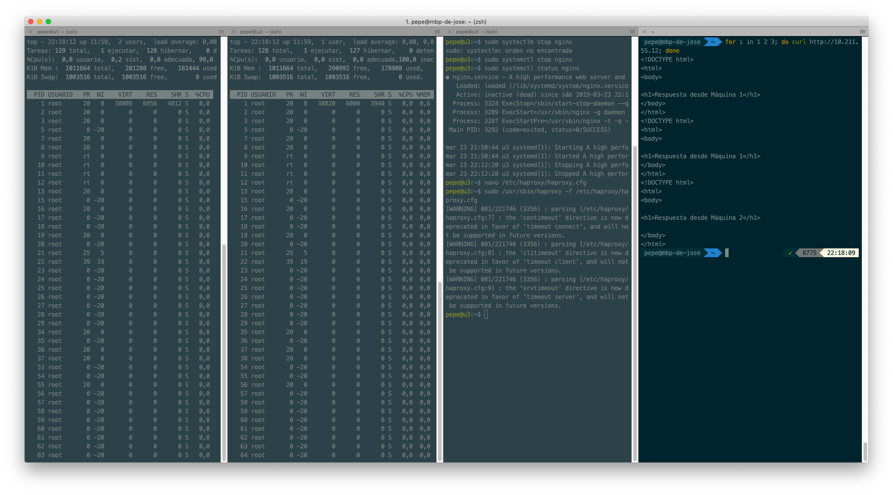
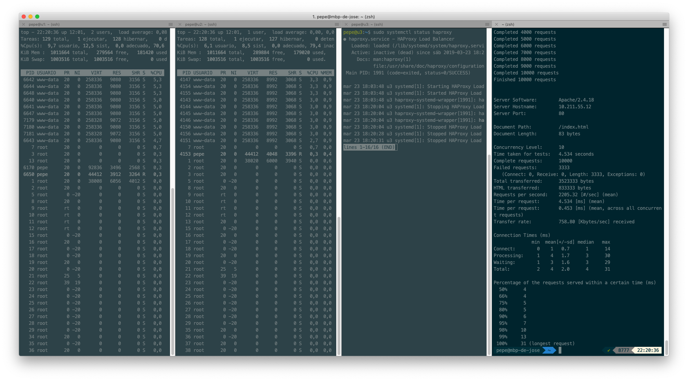
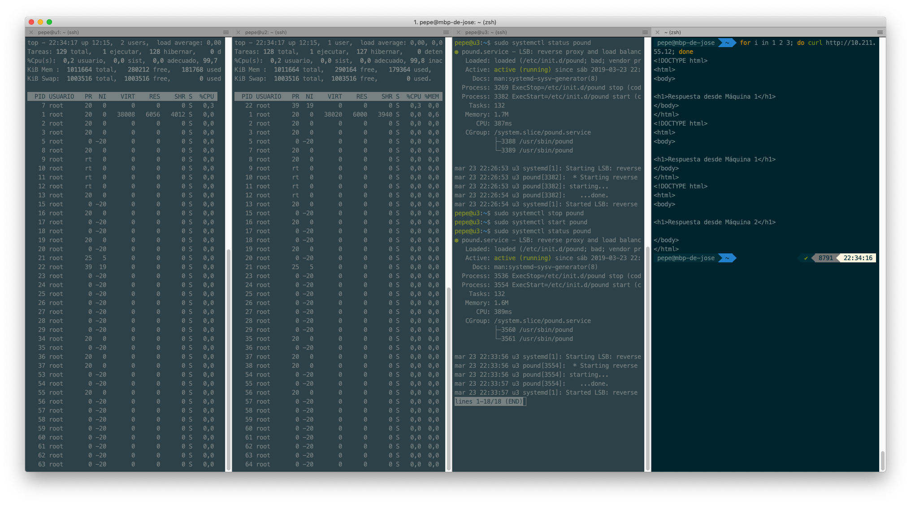
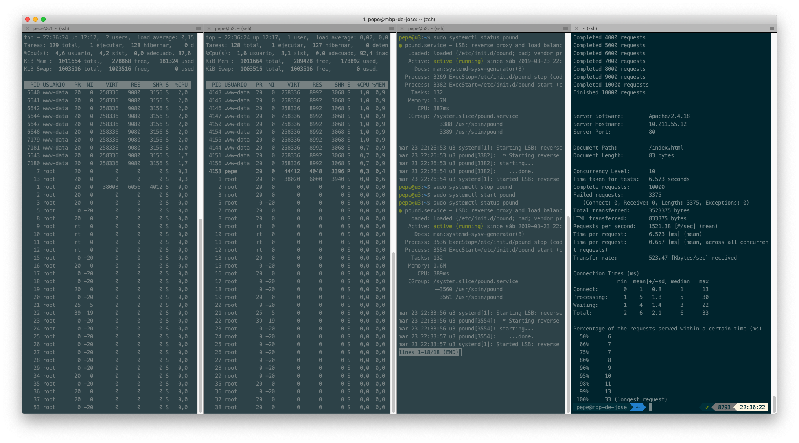

# Práctica 3: Balanceo de carga

```
Autor: José Antonio Córdoba Gómez
Email: joseinn@correo.ugr.es
Date:  Viernes 22 de Marzo de 2019
```

### 1. Nginx como balanceador de carga.

Tenemos una tercera máquina virtual con _ubuntu server 16.04 LTS_ sin *apache* configurado. En ella vamos a instalar nginx de la siguiente forma:

```
sudo apt-get update && sudo apt-get dist-upgrade && sudo apt-get autoremove
sudo apt-get install nginx
```

Una vez instalado vamos a iniciar el servicio de *nginx*:

```
sudo systemctl start nginx
```

Para que *nginx* funcione como balanceador de carga y no como servidor web, es necesario configurarlo. Para ello vamos a editar el archivo **/etc/nginx/conf.d/default.conf** de forma que el fichero contenga:


```
upstream apaches{
    server 10.211.55.9 weight=2;
    server 10.211.55.10;
}

server{
    listen 80;
    server_name balanceador;

    access_log /var/log/nginx/balanceado$
    error_log /var/log/nginx/balanceador$
    root /var/www/;

    location /
    {
        proxy_pass  http://apaches;
        proxy_set_header Host $host;
        proxy_set_header X-Real-IP $remo$
        proxy_set_header X-Forwarded-For$
        proxy_http_version 1.1;
        proxy_set_header Connection "";
    }
}
```

Con dicha configuración, hemos establecido que los servidores de la granja web tiene las direcciones 10.211.55.9 y 10.211.55.10 y que la máquina tras la primera dirección IP responderá a 2 peticiones web  y la segunda máquina a 1 (esta ha sido la forma para virtualizar que la primera máquina es dos veces más potente que la segunda, a causa del enunciado). Si no indicamos lo contrario, el algoritmo de balanceo será *roundrobin*, al ser éste algoritmo el pedido, no tocamos más el archivo de configuración de *nginx*.

Además, es necesario inhabilitar *nginx* como servidor web. Para ello hemos editado el archivo de configuración **/etc/nginx/nginx.conf** comentando la línea:

```
include /etc/nginx/sites-enabled/*;
```

Acto seguido hemos reiniciado el servicio de *nginx*.

Ahora podemos comprobar haciéndole 3 peticiones a la ip de la máquina balanceadora que ejecuta *nginx* (10.211.55.12) si se está cumpliendo el algoritmo *roundrobin* y los pesos asociados.



Es hora de realizar el test sobre cómo se comporta *nginx* como balanceador de carga en nuestra granja web, para ello usaremos *apache benchmark* (ab):

```
ab -n 10000 -c 10 http://10.211.55.12/index.html
```




Como podemos observar en el campo _Time taken for tests:_,  en realizar las 10000 peticiones con concurrencia de 10 ha tardado 4.464 segundos.


## 2. HAPROXY como balanceador de carga


Lo primero que debemos de realizar es parar al servicio de *nginx*:

```
sudo systemctl stop nginx
```



Ahora vamos a instalar *haproxy* y a configurarlo:


```
sudo apt-get install haproxy
```


La configuración de *haproxy *se encuentra en **/etc/haproxy/haproxy.cfg** y la configuraremos de la siguiente forma:

```
global
        daemon
        maxconn 256

defaults
        mode http
        contimeout 4000
        clitimeout 42000
        srvtimeout 43000

frontend http-in
        bind *:80
        default_backend servers

backend servers
        # Por defecto el algoritmo de balanceo
        # es roundrobin
        #balance roundrobin
        server m1 10.211.55.9 weight 100
        server m2 10.211.55.10 weight 50
```

Como se puede ver, la configuración responde a las mismas necesidades del apartado anterior: *roundrobin* y siendo la máquina 1 responsable de responder el doble de solicitudes que la máquina 2.

Ahora vamos a inciar el servicio _haproxy_

```
sudo /usr/sbin/haproxy -f /etc/haproxy/haproxy.cfg
```



Ahora vamos a pasar a realiar el test de carga con apache benchmark:



Podemos observar que *haproxy* ha tardado en completar la misma carga de trabajo: 4.534 segundos, 0.07 segundos más que *nginx*.


## 3. Pound como balanceador de carga
Como antes, es necesario parar el servicio de *haproxy*, para ello vamos a ayudarnos del comando _killall_.

Posteriormente instalamos la herramienta:

```
sudo apt-get install pound
```

Configuramos el archivo **/etc/pound/pound.cfg** y dejamos el archivo como sigue:

```## Minimal sample pound.cfg
##
## see pound(8) for details


###################################################$
## global options:

User            "www-data"
Group           "www-data"
#RootJail       "/chroot/pound"

## Logging: (goes to syslog by default)
##      0       no logging
##      1       normal
##      2       extended
##      3       Apache-style (common log format)
LogLevel        1

## check backend every X secs:
Alive           30

## use hardware-accelleration card supported by ope$
#SSLEngine      "<hw>"

# poundctl control socket
Control "/var/run/pound/poundctl.socket"


###################################################$
## redirect all requests on port 8080 ("ListenHTTP"$
ListenHTTP
        Address 10.211.55.12
        Port    80

        ## allow PUT and DELETE also (by default on$
        xHTTP           0

        Service
                BackEnd
                        Address 10.211.55.9
                        Port    80
                        Priority        2
                End

                BackEnd
                        Address 10.211.55.10
                        Port    80
                        Priority        1
                End
        End
End
```


De esta forma, cumplimos las mismas consideraciones que en los apartados 1 y 2 de la práctica.

A continuación iniciamos el servicio de *pound*:

```
sudo systemctl start pound
sudo systemctl stop pound
```

Vamos a comprobar que dichas consideraciones se estén cumpliendo:





A continuación vamos a someter a la misma carga que en los apartados 1 y 2 a *Pound*:




En este caso, ante el mismo estrés, _Pound_ ha tardado 6.573 segundos, mucho más que _nginx_ y que _haproxy_


## 4. Resumen comparativo

| Balanceador | Tiempo | Rendimiento            |
|:-----------:|:------:|------------------------|
|    nginx    |  4.464 | -                      |
|   haproxy   |  4.534 | 0,0015% peor que nginx |
|    pound    |  6.573 | 47,244% peor que nginx |


Podemos ver que el mejor software de balanceo de carga en nuestra configuración de máquinas es *nginx* obteniendo el menor de los tiempos de respuesta para hacer el test de estrés.