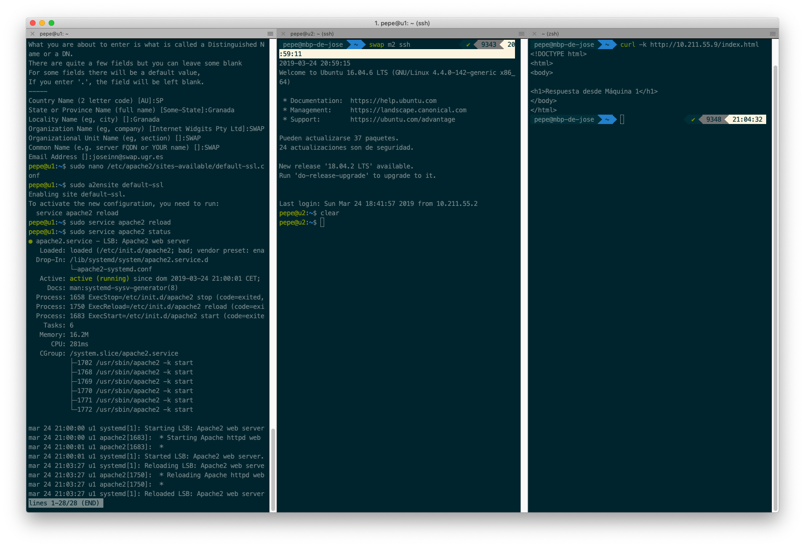
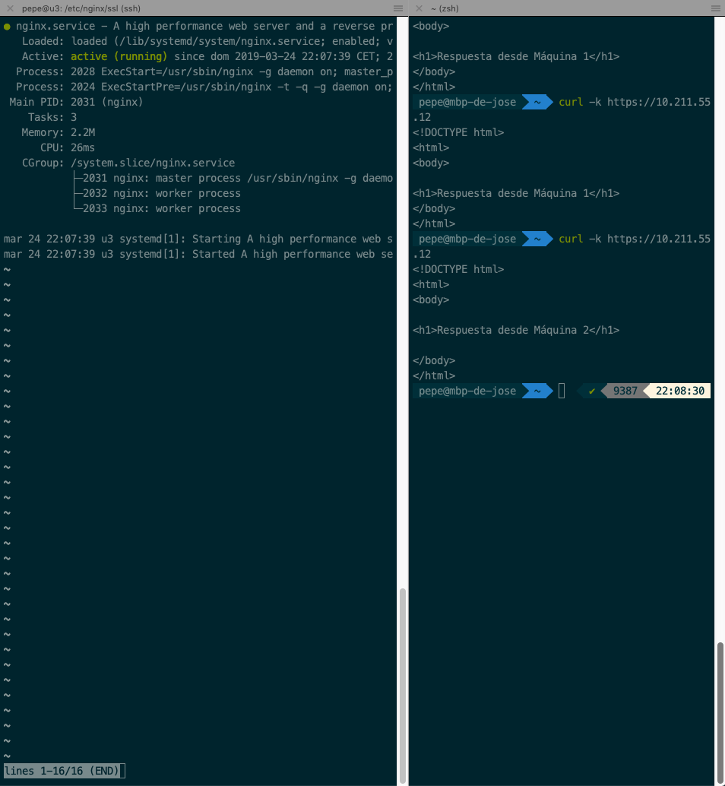
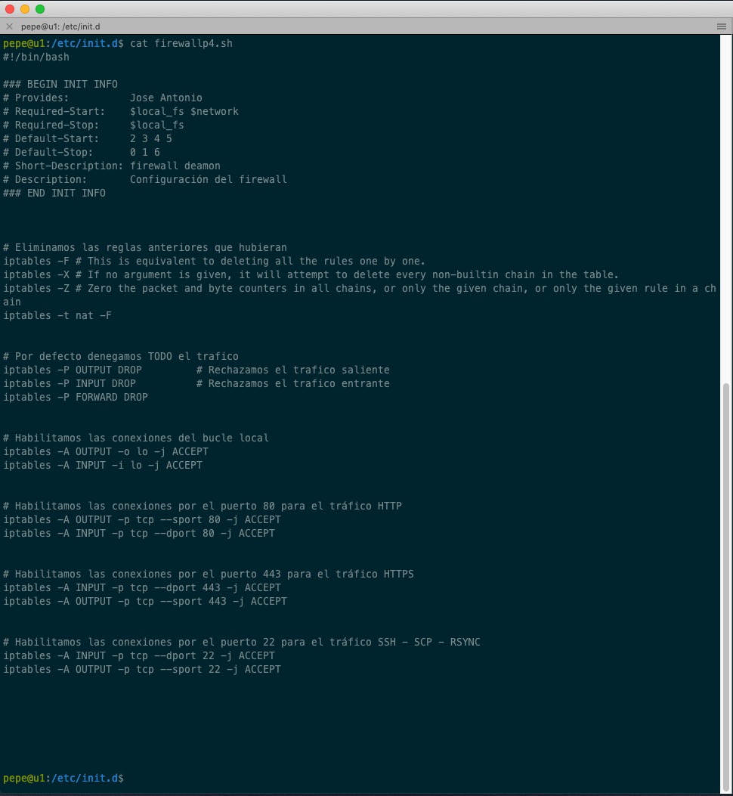
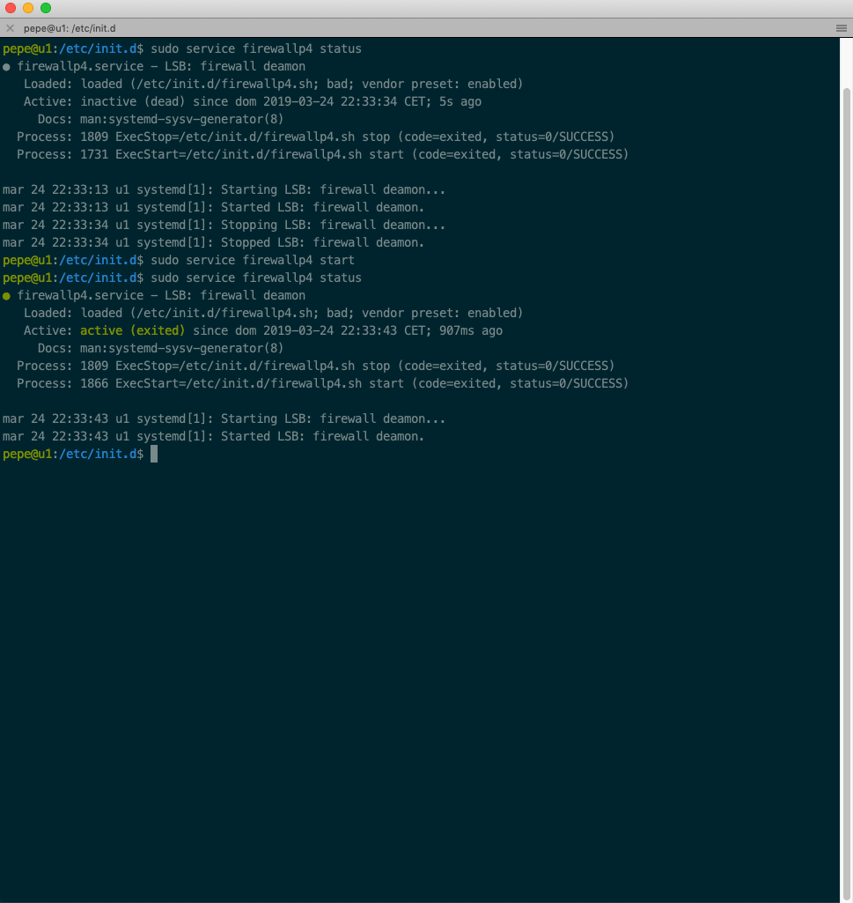

# Práctica 4: Asegurar la granja web

```
Autor: José Antonio Córdoba Gómez
Email: joseinn@correo.ugr.es
Date:  Viernes 29 de Marzo de 2019
```


# 1. Instalación del certificado SSL autofirmado

Generamos el certificado SSL autofirmado en la máquina 1

```
a2enmod ssl service apache2 restart
 mkdir /etc/apache2/ssl openssl req -x509 -nodes -days 365 -newkey rsa:2048 -keyout /etc/apache2/ssl/apache.key -out /etc/apache2/ssl/apache.crt
```

Editamos el archivo de configuración de Apache para indicarle donde se encuentra el certificado y la clave:

```
nano /etc/apache2/sites-available/default-ssl
```

Especificándole concretamente la ruta:

```
SSLCertificateFile /etc/apache2/ssl/apache.crt 
SSLCertificateKeyFile /etc/apache2/ssl/apache.key
```


Activamos el sitio web y reiniciamos el servicio:

```
a2ensite default-ssl
service apache2 reload
```

En la ventana de la derecha podemos observar cómo la máquina 1 responde ante peticiones https.



Una vez creado el certificado en la máquina 1 vamos a copiarlo en la máquina 2 y en la 3, solo que en la máquina 3, tenemos el balanceador de carga y la ruta que vamos a especificar nosotros para guardarla es */etc/nginx/ssl* en vez de la ruta propuesta (*/tmp*), quedándonos el archivo de configuración de *ngnix* como sigue:

```
upstream apaches{
    server 10.211.55.9 weight=2;
    server 10.211.55.10;
}

server{
    listen 80;
    listen [::]:80 ipv6only=on default_server;
    server_name balanceador;

    listen 443 ssl;
    ssl on;
    ssl_certificate /etc/nginx/ssl/apache.crt;
    ssl_certificate_key /etc/nginx/ssl/apache.key;


    access_log /var/log/nginx/balanceador.access.log;
    error_log /var/log/nginx/balanceador.error.log;
    root /var/www/;

    location /
    {
        proxy_pass  http://apaches;
        proxy_set_header Host $host;
        proxy_set_header X-Real-IP $remote_addr;
        proxy_set_header X-Forwarded-For $proxy_add_x_forwarded_for;
        proxy_http_version 1.1;
        proxy_set_header Connection "";
    }
}
```

Ahora probamos a realizar peticiones https desde fuera directamente a la máquina balanceadora (10.211.55.12) y vemos que efectivamente está balanceando el tráfico *https* tal y como esperábamos.



# 2. Configuración del firewall
Hemos diseñado un conjunto de tareas para que la máquina 1 ejecute como servicio con objetivo de configurar el firewall, dicho conjunto de tareas se resume en bloquear absolutamente todas las conexiones entrantes y salientes excepto las del bucle local, las dirigidas al puerto 80,443 y 22, o lo que es lo mismo, solo aceptamos las conexiones para tráfico *HTTP*, *HTTPS*, *SSH*, *SCP*, *RSYNC* y las que provengan de nuestro bucle local.

A continuación se muestra el conjunto de reglas: 



Nos hemos ayudado de *init.d* para realizar dicho conjunto de tareas un demonio o servicio del sistema:

```
nano firewallp4.sh
sudo chmod +x firewallp4.sh
sudo cp firewallp4.sh /etc/init.d/
sudo update-rc.d firewallp4.sh defaults
```

A continuación podemos observar como efectivamente ha pasado a ser un servicio (en la imagen se muestra ya activo).

