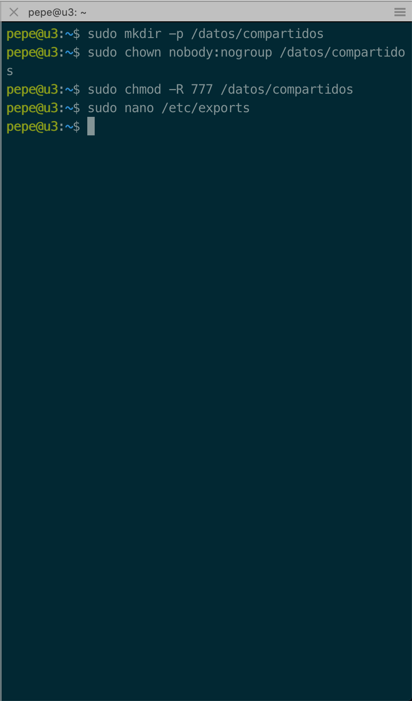
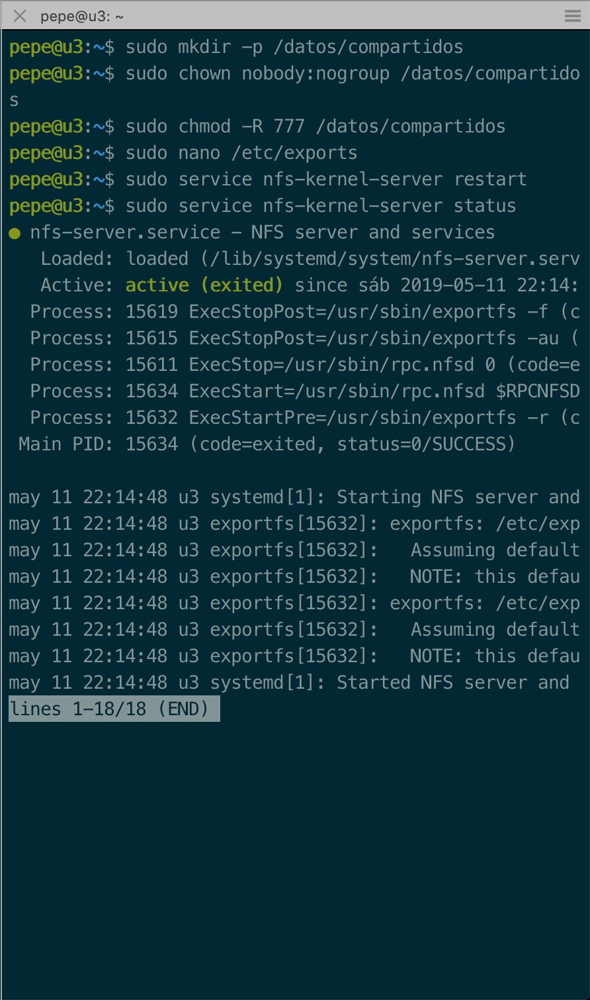
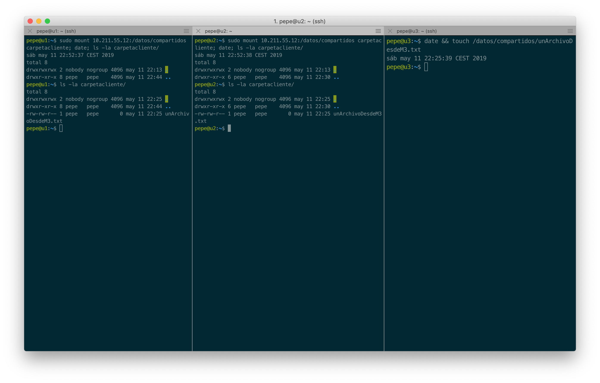
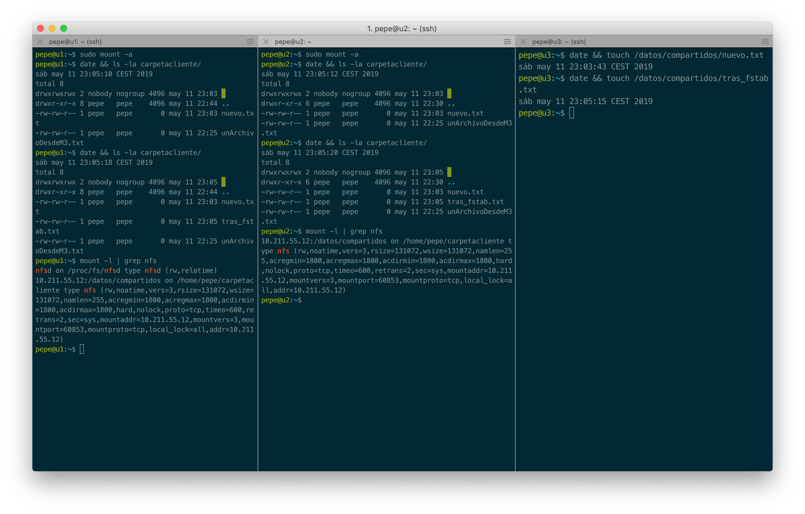
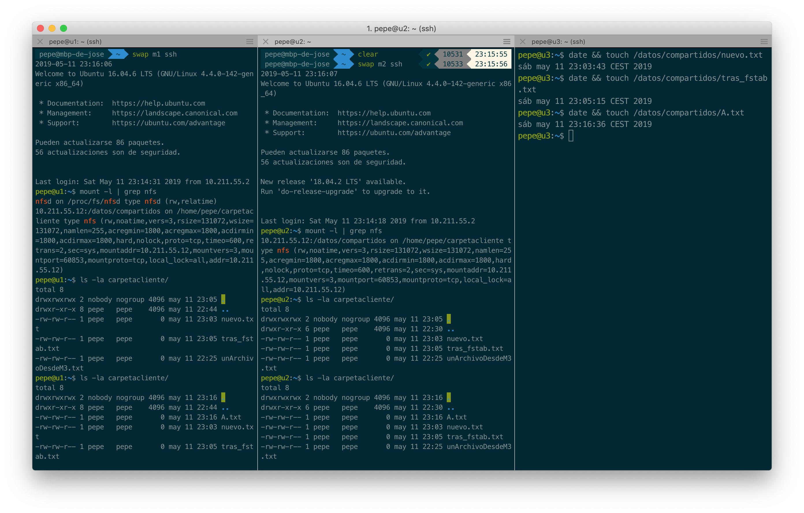

# Práctica 6: Servidor de disco NFS

```
Autor: José Antonio Córdoba Gómez
Email: joseinn@correo.ugr.es
Date:  Viernes 10 de Mayo de 2019
```


# 1. Configurar el servidor NFS

Primero instalamos el módulo *NFS Kernel server*:

```
sudo apt-get install nfs-kernel-server nfs-common rpcbind
```

A continuación creamos un directorio para compartir los datos mediante nfs y modificamos los permisos de dicho directorio:

```
sudo mkdir -p /datos/compartidos
sudo chown nobody:nogroup /datos/compartidos
sudo chmod -R 777 /datos/compartidos
```

Podemos ver el propietario y los permisos correctos del directorio creado en la siguiente captura de pantalla:



Añadimos la dirección de ip de la máquina 1 (*u1*) y  la máquina 2 (*u2*), que es en nuestro caso, las máquina que hemos dedicido hacer de cliente nfs de dicha carpeta, al archivo */etc/exports* quedándose como sigue:

```
# /etc/exports: the access control list for filesystems which may be exported
#               to NFS clients.  See exports(5).
#
# Example for NFSv2 and NFSv3:
# /srv/homes       hostname1(rw,sync,no_subtree_check) hostname2(ro,sync,no_subtre$
#
# Example for NFSv4:
# /srv/nfs4        gss/krb5i(rw,sync,fsid=0,crossmnt,no_subtree_check)
# /srv/nfs4/homes  gss/krb5i(rw,sync,no_subtree_check)
#
/datos/compartidos  10.211.55.9(rw) 10.211.55.10(rw)
```


Ahora reiniciamos el servicio y comprobamos que efectivamente está correctamente activo:

```
sudo service nfs-kernel-server restart
sudo service nfs-kernel-server status
```




# 2. Configurar los clientes

Primero instalamos los paquetes necesarios:

```
sudo apt-get install nfs-common rpcbind
```

Una vez instalados los paquetes necesarios, vamos a crear un directorio sobre el que vamos a realizar el montaje del directorio remoto que tenemos configurado sobre la máquina 3 (*u3*).

```
mkdir carpetacliente
chmod -R 777 carpetacliente
```

Este proceso lo ejecutamos en tantos clientes como necesitemos, en este caso, lo hemos realizado tanto en la máquina 1 (*u1*) como en la máquina 2 (*u2*).


A continuación montamos el directorio habilitado en la máquina 3 (*u3*) sobre la carpeta *carpetacliente* y probamos el funcionamiento creando un archivo y visualizándolo en el resto de máquinas.


Ejectuamos la siguiente orden en cada cliente:
```
sudo mount 10.211.55.12:/datos/compartidos carpetacliente; date; ls -la carpetacliente/
```

En la siguiente captura podemos observar una posible secuenciación de órdenes para montar el directorio remoto y creación de archivos en dicho directorio remoto y cómo queda efectuado y visible para el resto de clientes:





Ahora, para que este proceso de montaje se haga de forma automática cada vez que se inicia el sistema, vamos a crear una entrada de montaje en el archivo */etc/fstab*:

```
10.211.55.12:/datos/compartidos /home/pepe/carpetacliente nfs auto,noatime,nolock,bg,nfsvers=3,intr,tcp,actimeo=1800 0 0
```

Para probar que funciona primero desmontamos el dispositivo anteriormente montado con:

```
sudo umount 10.211.55.12:/datos/compartidos carpetacliente
```

Y comprobamos que efectivamente está desmontado con:

```
mount -l | grep nfs
```

Ahora bien reiniciamos o obligamos a montar todos los dispositivos que tienen entrada en el directorio */etc/fstab* tal y como hemos modificado anteriormente con la orden:

```
sudo mount -a
```

Ahora para volver a verificar que el sistema funciona, vamos a crear algun archivo y vamos a mostrar el contenido del directorio montado en los clientes así como los dispositivos montados que usen nfs, tal y como se puede observar en la siguiente captura de pantalla:




En la siguiente captura se puede ver exactamente lo mismo pero ejecutado justo después de reiniciar la máquinas, demostrando por tanto que el fichero */etc/fstab* está cargándose correctamente al inicio del sistema.

